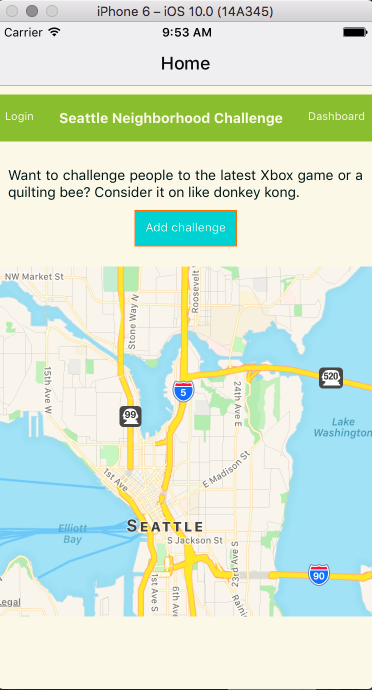
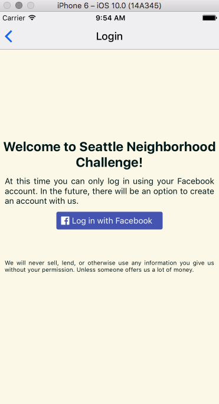
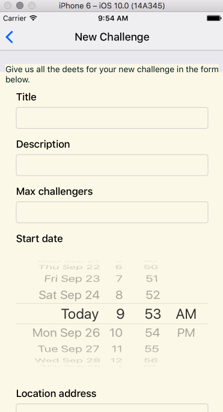

# Seattle Neighborhood Challenge (SNC)
A group project, wherein 6 web developers build an app that's kinda like Meetup but with more focus on spontaneity.

Here's how it works: people can challenge one another to activities. We encourage people to wander and find new interests through challenges, or participate in old favorites while meeting new people.

